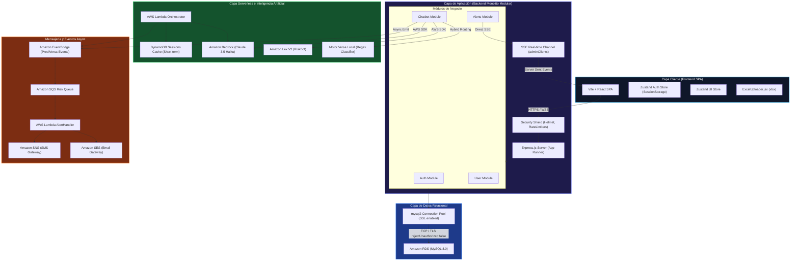
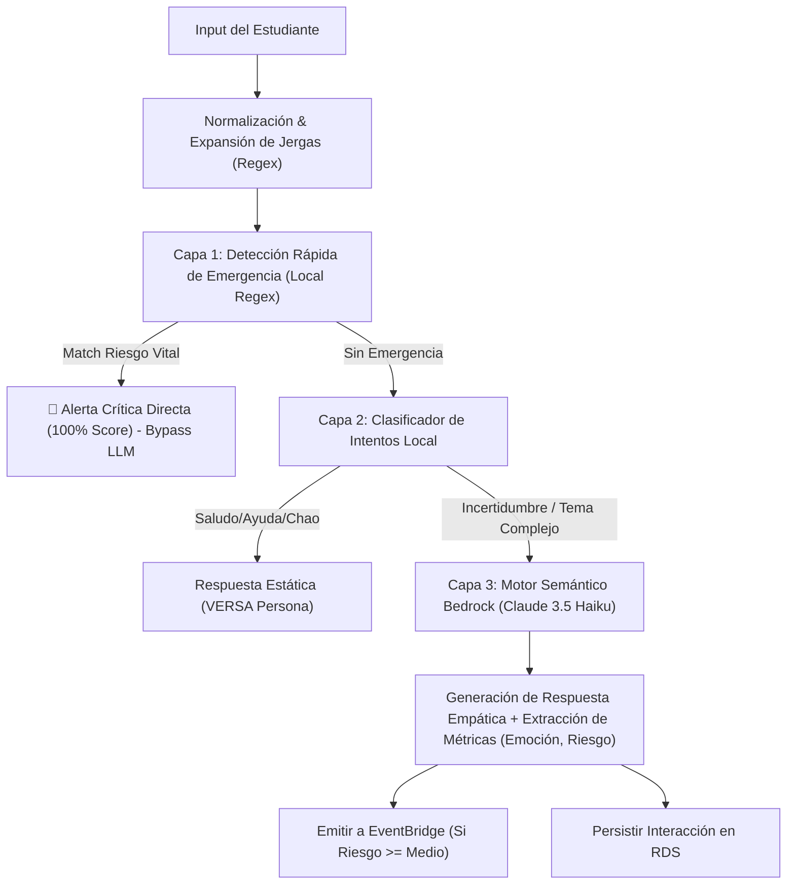

# PrediVersa v1.0 — Ingeniería Inversa de Arquitectura de Sistemas
## Reporte de Arquitectura Global, Modelado de Datos, Motor Conversacional y Despliegue en Nube AWS

Este documento contiene un análisis riguroso de ingeniería inversa sobre el ecosistema **PrediVersa (v1.0-Titanium)**. Se detallan los patrones de diseño aplicados, el modelado de datos relacional y transaccional, el motor conversacional híbrido de IA, la arquitectura de nube serverless recomendada en AWS, y un diagnóstico de vulnerabilidades, deudas técnicas y mitigaciones críticas.

---



---

## 1. ARQUITECTURA GLOBAL, WORKSPACE Y STACK

### 1.1 Patrón de Arquitectura Global
El backend de **PrediVersa** implementa un patrón **Modular Monolith (Monolito Modular)** estructurado bajo la metodología **Service-Repository (Capa de Servicios y Repositorios)**. Esta separación de responsabilidades asegura el desacoplamiento del transporte (HTTP/Express) con la lógica de negocio y el acceso a datos directo:
*   **Controladores (`*.controller.js`)**: Encapsulan la capa de transporte. Validan entradas rápidas, controlan flujos HTTP/REST y administran excepciones mediante Express.
*   **Servicios (`*.service.js`)**: Contienen el núcleo de la lógica de negocio. Realizan la orquestación de la IA, aplican reglas de negocio complejas (ej: lógica de reasignación basada en roles, iniciación de alertas manuales y reactivaciones) y delegan la persistencia.
*   **Repositorios (`*.repository.js`)**: Representan la capa de acceso a datos puramente aislada. Ejecutan consultas parametrizadas directas sobre la base de datos SQL para mantener el máximo rendimiento y control transaccional sin el overhead de un ORM pesado.

Por otra parte, la interacción con la IA y notificaciones omnicanal se ha **desacoplado progresivamente** a través de una **Arquitectura Dirigida por Eventos (EDA - Event-Driven Architecture)** mediante Lambda, EventBridge y SQS, lo que mitiga los cuellos de botella por latencia externa de las LLM.

El frontend sigue una arquitectura **SPA (Single Page Application)** clásica reactiva utilizando **Vite + React**, centralizando sus flujos de estado mediante **Zustand** para lograr un acoplamiento flojo y alta velocidad en interfaces dinámicas.

### 1.2 Organización del Workspace y Archivos Raíz
El directorio del proyecto está diseñado para separar limpiamente las responsabilidades de desarrollo local y de despliegue en nube:

*   `/backend`: Contiene la lógica del servidor API.
    *   `/src/app.js`: Configura el servidor Express, middlewares de seguridad, CORS dinámico, compresión, escudo Helmet y enrutador.
    *   `/src/server.js`: Punto de entrada del servidor. Realiza el binding del socket TCP a `0.0.0.0` (vital para los health checks de AWS App Runner) y la inicialización asíncrona de la base de datos.
    *   `/src/db`: Módulo de conexión centralizada y scripts de migración.
    *   `/src/middleware`: Interceptores de autenticación (JWT), auditoría de seguridad y Rate Limiting.
    *   `/src/modules`: Los dominios de negocio organizados de forma autónoma (`alerts`, `auth`, `chatbot`, `config`, `dashboard`, `users`).
    *   `/lambdas`: Código serverless optimizado para ser empaquetado y desplegado de forma independiente en AWS.
*   `/frontend`: El proyecto reactivo cliente.
    *   `vite.config.js`: Define el pipeline de bundler rápido e inyección de variables de entorno seguras.
    *   `amplify.yml`: Script de aprovisionamiento CI/CD declarativo para AWS Amplify que controla el build del bundle estático y fallback SPA.

### 1.3 Stack Tecnológico Detallado

| Componente | Tecnología | Propósito Técnico |
| :--- | :--- | :--- |
| **Backend Framework** | Node.js + Express | Servidor HTTP REST ligero con baja latencia y alta concurrencia por bucle de eventos. |
| **Frontend Framework** | React 18 + Vite | Interfaz SPA de alta reactividad, renderizado optimizado y bundler basado en ESBuild. |
| **Base de Datos Principal**| AWS RDS MySQL 8.0 | Persistencia relacional robusta con soporte para transacciones ACID, integridad referencial e indexación compuesta. |
| **Base de Datos Caché** | AWS DynamoDB | Almacenamiento clave-valor ultra rápido para memoria corta de sesiones de chat en Lambdas. |
| **State Management** | Zustand (v5.0) | Manejo de estado ligero en frontend con persistencia segmentada en `sessionStorage` para mitigar ataques XSS. |
| **Seguridad de Red** | Helmet + Express Rate Limit | Inyección de cabeceras estrictas de seguridad (HSTS, CSP) y mitigación de fuerza bruta / denegación de servicio (DoS). |
| **Inteligencia Artificial** | Bedrock (Claude 3.5 Haiku) | Análisis semántico profundo en lenguaje natural, categorización de riesgo, emoción e identidad de género. |
| **Motor Conversacional V2**| Amazon Lex V2 | Reconocimiento de intenciones (NLU) estructurado con soporte nativo para idioma español (`es_419`). |
| **Mensajería e Integración**| AWS EventBridge + SQS | Cola de mensajería desacoplada e ingesta asíncrona de eventos de riesgo críticos para procesamiento elástico en Lambda. |
| **Observabilidad** | Winston Logger | Registro de logs en formato estructurado JSON optimizado para ingestión directa en AWS CloudWatch. |

---

## 2. MODELADO DE DATOS Y CAPA DE PERSISTENCIA (RDS & CACHE)

El motor de persistencia relacional se implementa directamente en **AWS RDS MySQL**, garantizando la robustez referencial que requiere un sistema de alertas estudiantiles y de seguimiento.

### 2.1 Esquema Consolidado y Entidades Core
La estructura de tablas se define de forma idempotente en [connection.js](file:///d:/PrediVersa-V.1-main/PrediVersa-V.1-main/backend/src/db/connection.js#L95-L295):

1.  **`users`**: Entidad de usuarios con autenticación y datos de perfil.
    *   `id` (INT PK, Auto_Increment)
    *   `documentId` (VARCHAR(20) UNIQUE)
    *   `email` (VARCHAR(100) UNIQUE)
    *   `password` (VARCHAR(255) - Almacena hashes con salting Bcrypt)
    *   `role` (ENUM('Estudiante', 'Administrador', 'Colaboradores'))
    *   `status` (ENUM('Activo', 'Inactivo'))
    *   `createdAt`, `updatedAt` (TIMESTAMP)
    *   *Índices clave*: `idx_role` para búsquedas agrupadas por perfiles de analistas, `idx_status` e `idx_user_lookup` compuesto por `(email, role, status)` para agilizar el login.

2.  **`refresh_tokens`**: Auditoría de sesiones de seguridad (JWT Refresh Strategy).
    *   `id` (INT PK)
    *   `user_id` (INT FK -> `users(id)`)
    *   `token` (VARCHAR(500) Indexado)
    *   `is_revoked` (BOOLEAN)
    *   `expires_at` (TIMESTAMP)

3.  **`alerts`**: Gestión de riesgo de violencia escolar.
    *   `id` (INT PK)
    *   `studentName` (VARCHAR(100))
    *   `studentUsername` (VARCHAR(100) - Email institucional)
    *   `alertType` (ENUM('Informativa', 'Preventiva', 'Advertencia', 'Critica'))
    *   `description` (TEXT)
    *   `ticketNumber` (VARCHAR(20) - Formato de trazabilidad corporativo)
    *   `status` (ENUM('Pendiente', 'En Proceso', 'Resuelta', 'Cerrada', 'Urgente'))
    *   `assignedTo` (INT FK -> `users(id)`)
    *   `restart_count` (INT - Contador de ciclos de reinicios de casos)
    *   `parent_alert_id` (INT FK -> `alerts(id)` - Relación reflexiva para trazabilidad de reinicios)
    *   *Índices clave*: `idx_alerts_dashboard` compuesto por `(status, alertType, createdAt)` para analíticas del panel de control de administración.

4.  **`alert_history`**: Audit Trail detallado para cada alerta (Historial).
    *   `id` (INT PK)
    *   `alert_id` (INT FK -> `alerts(id)`)
    *   `action` (ENUM('created', 'assigned', 'restarted', 'closed', 'updated', 'commented'))
    *   `performed_by` (INT FK -> `users(id)`)
    *   `metadata` (JSON - Permite registrar de manera estructurada y flexible los cambios de roles y deadlines)

5.  **`chatbot_interacciones`**: Log analítico del chatbot VERSA.
    *   `id` (INT PK)
    *   `session_id` (VARCHAR(100) - ID de sesión)
    *   `user_input` (TEXT)
    *   `response` (TEXT)
    *   `risk` (VARCHAR(20))
    *   `risk_score` (DECIMAL(5,2))
    *   `createdAt` (TIMESTAMP)
    *   *Índices clave*: `idx_chatbot_analytics` compuesto por `(createdAt, risk_score, risk)`.

### 2.2 Estrategia de Persistencia, Transacciones y Pool
El backend utiliza un Pool de conexiones robusto configurado en `mysql2` para evitar fugas de sockets y sobrecargas de RDS:
*   **Parámetros Críticos del Pool**:
    *   `connectionLimit: 50` (Permite manejar con seguridad ráfagas masivas de analítica escolar).
    *   `connectTimeout` y `acquireTimeout` en `20000ms`.
    *   `enableKeepAlive: true` con delay de `10000ms` para mantener sockets calientes en el balanceador.
*   **Seguridad de Capa TLS (Bypass de Cadena de Certificación)**:
    ```javascript
    sslConfig = { rejectUnauthorized: false };
    ```
    *Razón de Diseño*: AWS RDS utiliza rotaciones de certificados de CA en sus endpoints. Para evitar fallos repentinos de despliegue ("self-signed certificate in certificate chain"), se establece `rejectUnauthorized: false`. La conexión **continúa totalmente cifrada** bajo protocolo TLS v1.2/v1.3, únicamente delegando la verificación rígida de la cadena de confianza a nivel de máquina de NodeJS.

### 2.3 Gestión de Estado Global (Frontend Caching)
La gestión de estado dinámico se realiza mediante **Zustand**. El almacén de autenticación (`useAuthStore`) cuenta con medidas de seguridad de nivel financiero:
*   **Mitigación de XSS Persistente**: Se configura `sessionStorage` como el motor de persistencia dinámico en lugar de `localStorage`. De esta manera, el token de sesión se destruye automáticamente al cerrarse la pestaña del navegador.
*   **Particionamiento de Persistencia**: A través de `partialize`, el token JWT nunca se escribe en disco ni se persiste directamente; solo se conserva en memoria volátil de la aplicación, guardando en sesión únicamente el perfil básico del usuario (`user`) y el flag boolean `isAuthenticated`.

---

## 3. ARQUITECTURA DE CHATBOT Y COMPONENTES CONVERSACIONALES

El sistema conversacional **VERSA** implementa una arquitectura híbrida de tres capas de procesamiento para garantizar una alta velocidad, precisión semántica, contención de costos e infalibilidad en riesgos vitales.



### 3.1 Pipeline de Procesamiento Conversacional (Paso a Paso)

1.  **Capa 1: Sanitización y Normalización**:
    El mensaje del estudiante pasa por una limpieza profunda en [centralAIService.js](file:///d:/PrediVersa-V.1-main/PrediVersa-V.1-main/backend/src/utils/centralAIService.js#L32-L47):
    *   Elimina acentos y diacríticos (`NFD` normalization).
    *   Traduce jergas de mensajería estudiantil y abreviaciones comunes (`q` -> `que`, `xq` -> `porque`, `toy` -> `estoy`).
    *   Elimina caracteres especiales ofensivos o spam visual.

2.  **Capa 2: Detección Defensiva de Emergencia Crítica (Local Regex)**:
    Antes de cualquier procesamiento de IA externa, se ejecuta un análisis de palabras clave de alto impacto (ideación suicida, abuso grave, armas, secuestro).
    *   *Si hace match*: Se asume de inmediato un `Riesgo Alto (Score 100)`, se genera una remisión inmediata, se emite una alerta crítica en el acto y se **omite por completo la llamada a la LLM** para evitar cualquier alucinación en situaciones extremas de vida o muerte.

3.  **Capa 3: Clasificador Ligero de Intentos (Local Classify)**:
    Si no hay emergencia, se evalúa contra expresiones regulares locales de saludo, ayuda y despedidas. Si la confianza es alta, se responde con un fallback predefinido ahorrando tiempo de respuesta y coste de tokens en la LLM.

4.  **Capa 4: Análisis Semántico Profundo (AWS Bedrock & Lex)**:
    Para entradas libres y complejas, el mensaje sanitizado se encapsula bajo etiquetas XML estrictas (`<user_message>`) para prevenir ataques de inyección de prompts (Prompt Injection).
    *   **Modelo**: Claude 3.5 Haiku.
    *   **System Prompt Estricto**: Exige retornar únicamente un esquema JSON estructurado con el nivel de riesgo (`LOW`, `MEDIUM`, `HIGH`, `CRITICAL`), score (`0-100`), emoción e intención detectada.
    *   **Orquestación AWS Lex**: Paralelamente, se invoca `sendToLex` con el bot `PrediVersa_RiskBot_V1` en formato nativo en español (`es_419`) para correlacionar con flujos conversacionales interactivos de ayuda estudiantil.

5.  **Capa 5: Blindaje de Respuesta Empática (Failsafe Safeguard)**:
    Una vez generada la respuesta por Bedrock, el servicio inyecta de forma determinista un mensaje de soporte humanizado si se detecta un nivel de riesgo moderado o alto, asegurando que el estudiante siempre reciba la instrucción de hablar con un adulto de confianza u orientador, incluso si la LLM no lo integró correctamente.

---

## 4. INFRAESTRUCTURA CLOUD Y DESPLIEGUE EN AWS

El diseño arquitectónico para AWS se fundamenta en un desacoplamiento elástico, alta disponibilidad y máxima seguridad mediante un enfoque híbrido Serverless.

```
                         [ TRÁFICO DE CLIENTE ]
                                    │
                                    ▼
                          [ AWS Route 53 (DNS) ]
                                    │
               ┌────────────────────┴────────────────────┐
               ▼                                         ▼
   [ AWS Amplify (Hosting) ]                 [ AWS WAF (Web App Firewall) ]
   (React Frontend SPA)                                  │
                                                         ▼
                                          [ AWS App Runner (Backend Server) ]
                                          (Express API en Contenedor)
                                                         │
               ┌─────────────────────────────────────────┼────────────────────────────────────────┐
               ▼                                         ▼                                        ▼
   [ Amazon RDS (MySQL 8.0) ]              [ Amazon EventBridge ]                     [ Amazon Bedrock ]
   (Base de Datos Relacional)             (PrediVersa-Events Bus)                    (Claude 3.5 Haiku)
                                                         │
                                                         ▼
                                                [ Amazon SQS Queue ]
                                              (Critical Alert Broker)
                                                         │
                                                         ▼
                                            [ AWS Lambda AlertHandler ]
                                                         │
                                           ┌─────────────┴─────────────┐
                                           ▼                           ▼
                                    [ Amazon SNS ]               [ Amazon SES ]
                                    (SMS Gateway)               (Email Gateway)
```

### 4.1 Componentes de Infraestructura AWS Mapeados

*   **AWS Amplify**: Aloja la SPA de React. Configura el build de producción automatizado y el redireccionamiento para SPA (evitando el molesto error 404 al recargar páginas internas como `/student` o `/admin`).
*   **AWS App Runner**: Servicio totalmente administrado para alojar contenedores del backend Express (`Dockerfile` integrado en `/backend`). Es ideal porque implementa balanceador de carga automático, certificados SSL automáticos y escalado elástico inmediato a nivel de CPU/Memoria.
*   **Amazon RDS MySQL**: Motor de base de datos relacional primario desplegado en una subred privada multi-AZ para evitar accesos públicos indeseados y garantizar failover automático.
*   **Amazon DynamoDB**: Almacena el historial reciente de las conversaciones (`PrediVersa-Sessions` tabla con `sessionId` como partition key) para dar memoria de corto plazo a los contenedores y lambdas serverless sin estresar a RDS.
*   **Amazon EventBridge (`PrediVersa-Events`)**: Bus de eventos serverless que desacopla la detección de alertas en el chatbot de los sistemas de envío de correos o mensajería de texto.
*   **Amazon SQS**: Cola de mensajería elástica que almacena en búfer los eventos de riesgo severos para que la lambda de envío los consuma de manera controlada y sin pérdida de datos en caso de caídas del proveedor de telefonía o correos.
*   **AWS Lambda**:
    *   `orchestrator.handler`: Invocado de manera serverless para procesar el flujo del chat usando Bedrock, consultar DynamoDB y emitir eventos.
    *   `alertHandler.handler`: Activado por SQS para orquestar la mensajería SMS y de correos electrónicos.

### 4.2 Flujo de Red y Seguridad (VPC, Subnets)
La infraestructura se despliega bajo una arquitectura de **VPC de tres capas de subredes** para blindar la capa de datos:

1.  **Capa Pública**: Aloja el Application Load Balancer (ALB) expuesto y endpoints públicos del backend controlados por AWS WAF (Web Application Firewall) para repeler ataques de inyección SQL, Cross-Site Scripting (XSS) y Denegación de Servicio (DDoS).
2.  **Capa Privada**: Aloja los nodos de procesamiento de App Runner y Lambdas de integración, comunicándose con la base de datos a través de VPC Endpoints internos.
3.  **Capa Aislada**: Aloja la base de datos relacional AWS RDS de manera que ningún socket del exterior pueda conectarse a ella directamente. Solo se habilitan accesos TCP en el puerto 3306 desde el Security Group asignado a la capa privada.

---

## 5. CICLO DE VIDA DE UNA PETICIÓN (FLUJO END-TO-END)

A continuación, se mapea detalladamente la trayectoria que realiza un dato de alta criticidad en el sistema: desde que un estudiante ingresa un texto de riesgo de autolesión en la UI, hasta que se dispara la alerta a los orientadores a través de múltiples canales en tiempo real.

```
[UI React] ---> POST /api/chatbot/message ---> [app.js Express]
                                                      │ (requestId generado)
                                                      ▼
                                            [chatbot.service.js]
                                                      │
                                                      ▼
                                            [centralAIService.js] (Bedrock)
                                                      │
                                    ┌─────────────────┴─────────────────┐
                       (Riesgo Detectado >= Medio)               (Respuesta Empática)
                                    │                                   │
                                    ▼                                   ▼
                            [EventBridge Event]                 [Save Interaction DB]
                                    │                                   │
                                    ├──────────────────────────┐        ▼
                                    ▼                          ▼   [JSON HTTP Response]
                              [SQS Broker]               [RDS Alerts Table]     │
                                    │                          │                ▼
                                    ▼                          ▼            [UI React]
                            [Lambda Handler]             [SSE Broadcast] (Real-time Dashboard)
                                    │
                     ┌──────────────┴──────────────┐
                     ▼                             ▼
               [SNS SMS sent]               [SES Email sent]
```

1.  **Ingreso en UI**: Un estudiante escribe en el componente [ChatbotVersa.jsx](file:///d:/PrediVersa-V.1-main/PrediVersa-V.1-main/frontend/src/components/ChatbotVersa.jsx) el mensaje: *"Me siento muy solo en el colegio y ya no quiero vivir"*.
2.  **Envío HTTP**: Se dispara un request `POST /api/chatbot/message` enviando el payload con la sesión y el texto.
3.  **Interceptor de Seguridad (Express)**:
    *   [app.js](file:///d:/PrediVersa-V.1-main/PrediVersa-V.1-main/backend/src/app.js#L20-L24) intercepta la petición, genera un UUID de trazabilidad (`req.requestId`) y lo asocia a los encabezados.
    *   Se valida la política CORS contra la lista blanca en producción y se evalúan límites de peticiones por IP (`RateLimit`).
4.  **Capa de Servicios**:
    *   `chatbot.controller` recibe la carga, valida la sesión del usuario decodificada del JWT y delega a `chatbot.service.processMessage`.
5.  **Capa de IA y Clasificación de Riesgo**:
    *   Se invoca [centralAIService.analizarContextoTotalV3](file:///d:/PrediVersa-V.1-main/PrediVersa-V.1-main/backend/src/utils/centralAIService.js#L105-L180).
    *   La Capa 1 de Emergencias detecta de inmediato `"no quiero vivir"` mediante expresiones regulares deterministas. Se omite llamada directa a Claude 3.5 Haiku y se asigna instantáneamente: `Riesgo: ALTO`, `Score: 100`, `Eje: VITAL`.
6.  **Desacoplamiento de Evento de Riesgo**:
    *   El servicio de IA emite asíncronamente el evento `RiskAnalysisResult` con payload estructurado hacia **Amazon EventBridge**.
    *   El motor de bases de datos persiste localmente la conversación en la tabla `chatbot_interacciones` registrando las métricas semánticas asociadas.
7.  **Persistencia Transaccional y Tiempo Real Directo (Dashboard)**:
    *   De forma concurrente, el servicio invoca a `alertRepository.create` insertando una nueva alerta en la tabla `alerts` con estado `Urgente` y número de ticket asignado `VERSA-XXXXXXXXXX`.
    *   [notificaciones.js](file:///d:/PrediVersa-V.1-main/PrediVersa-V.1-main/backend/src/utils/notificaciones.js#L27-L53) recibe la señal e invoca `enviarSSE`. Se realiza una transmisión en tiempo real sobre los sockets web activos (`adminClients`) actualizando de manera inmediata el componente del panel de administración del orientador en menos de 100 milisegundos.
8.  **Respuesta Conversacional**:
    *   La API Express responde con éxito devolviendo la respuesta conversacional empática y segura (incluso inyectando de forma forzada el número de soporte y contención emocional).
9.  **Despacho Omnicanal Serverless**:
    *   En la infraestructura de AWS, **EventBridge** enruta el evento de riesgo alto directamente hacia la cola **Amazon SQS**.
    *   La Lambda `alertHandler` consume el mensaje SQS en background y ejecuta la lógica omnicanal:
        *   Invoca **Amazon SNS** enviando un mensaje SMS urgente al móvil de los coordinadores configurados.
        *   Invoca **Amazon SES** despachando un correo electrónico enriquecido en formato HTML detallando el ticket, nombre del estudiante, texto del mensaje y remisión prioritaria.

---

## 6. DIAGNÓSTICO DE PUNTOS CRÍTICOS Y RECOMENDACIONES DE SEGURIDAD

### 6.1 Puntos Críticos Identificados

1.  **Acoplamiento de Mensajería en Tiempo Real (SSE Memory Leak Risk)**:
    En `notificaciones.js`, los clientes que abren canales Server-Sent Events (SSE) se almacenan en un `Set` en memoria volátil de NodeJS (`adminClients`).
    *   *Riesgo*: Si el servidor Express escala horizontalmente (múltiples réplicas en App Runner), los administradores conectados a la réplica A no recibirán las alertas disparadas por el chatbot en la réplica B. Adicionalmente, si las conexiones TCP de SSE no se destruyen correctamente del Set ante desconexiones repentinas del navegador, se generará una fuga de memoria (Memory Leak) persistente en el servidor.
    *   *Gravedad*: **Alta** (Afecta escalabilidad y alta disponibilidad).

2.  **Tratamiento de Excepciones del Servidor Express (Detailed Error Exposure)**:
    En [app.js](file:///d:/PrediVersa-V.1-main/PrediVersa-V.1-main/backend/src/app.js#L139-L161), el middleware global de control de errores expone directamente la traza de llamadas y el stack trace (`err.stack`) en formato JSON al cliente, sin importar el entorno de ejecución:
    ```javascript
    res.status(statusCode).json({ 
      success: false, 
      message: message, 
      stack: err.stack, // EXPOSICIÓN DE ARQUITECTURA DE CÓDIGO
      requestId: req.requestId || 'no-id'
    });
    ```
    *Régimen de Falla*: Un atacante podría enviar cargas payload deformadas de manera intencionada para provocar excepciones de base de datos y recolectar nombres de tablas, líneas de código y estructuras internas expuestas en el stack trace.
    *   *Gravedad*: **Media-Alta** (Fuga de Información Crítica de Seguridad).

3.  **Gestión de Dependencias y Tokens de Respaldo Habilitados**:
    En `auth.service.js` y el middleware `auth.js`, si el entorno carece de la clave `JWT_SECRET`, el sistema inicializa una clave fallback por defecto (`PrediVersa*Titanium*Secure*Key*2026!`).
    *   *Riesgo*: Si por un error humano el administrador olvida inyectar la variable de entorno en AWS, el servidor seguirá funcionando de forma silenciosa pero utilizando una firma predecible y pública, comprometiendo todo el esquema criptográfico de las sesiones.
    *   *Gravedad*: **Crítica** (Integridad del Sistema).

### 6.2 Recomendaciones Arquitectónicas y de Mitigación

1.  **Transición de SSE a un Broker de Pub/Sub Distribuido**:
    Para soportar múltiples instancias elásticas en AWS App Runner, es vital migrar el almacenamiento de sockets SSE locales a un backend pub/sub distribuido como **Amazon ElastiCache (Redis)** o bien implementar **AWS AppSync / Amazon API Gateway WebSockets**:
    ```
    [Express Instance A] ──┐
                          ├───> [Redis Pub/Sub Channel] ───> [Real-time Clients]
    [Express Instance B] ──┘
    ```
    *Efecto*: Garantiza que las notificaciones dinámicas del Dashboard funcionen a nivel global sin importar a qué instancia física del backend se conecte el analista.

2.  **Hardening de Middleware de Errores para Producción**:
    Modificar el manejador global de excepciones en `app.js` para censurar detalles de bajo nivel en producción:
    ```javascript
    const isDevelopment = process.env.NODE_ENV === 'development';
    res.status(statusCode).json({ 
      success: false, 
      message: statusCode === 500 && !isDevelopment ? 'Error interno en el servidor.' : message, 
      ...(isDevelopment && { stack: err.stack }), // Solo en desarrollo local
      requestId: req.requestId || 'no-id'
    });
    ```

3.  **Fallo Duro de Inicialización Cryptográfica (Fail-Fast Strategy)**:
    En lugar de permitir claves por defecto en producción, configure el servidor Express para que aborte el arranque inmediatamente si no detecta una variable criptográfica segura en las configuraciones:
    ```javascript
    if (!process.env.JWT_SECRET && process.env.NODE_ENV === 'production') {
      console.error('🚨 ERROR CRÍTICO: JWT_SECRET no configurado en entorno de producción. Abortando inicio...');
      process.exit(1); // Fail-Fast
    }
    ```

4.  **Encriptación de Datos PII en Reposo en RDS**:
    Dado que las tablas `users` y `alerts` contienen información de menores y PII altamente confidencial, se sugiere forzar el encriptado nativo AES-256 en reposo a nivel de volumen de almacenamiento de AWS RDS (usando llaves KMS administradas).
